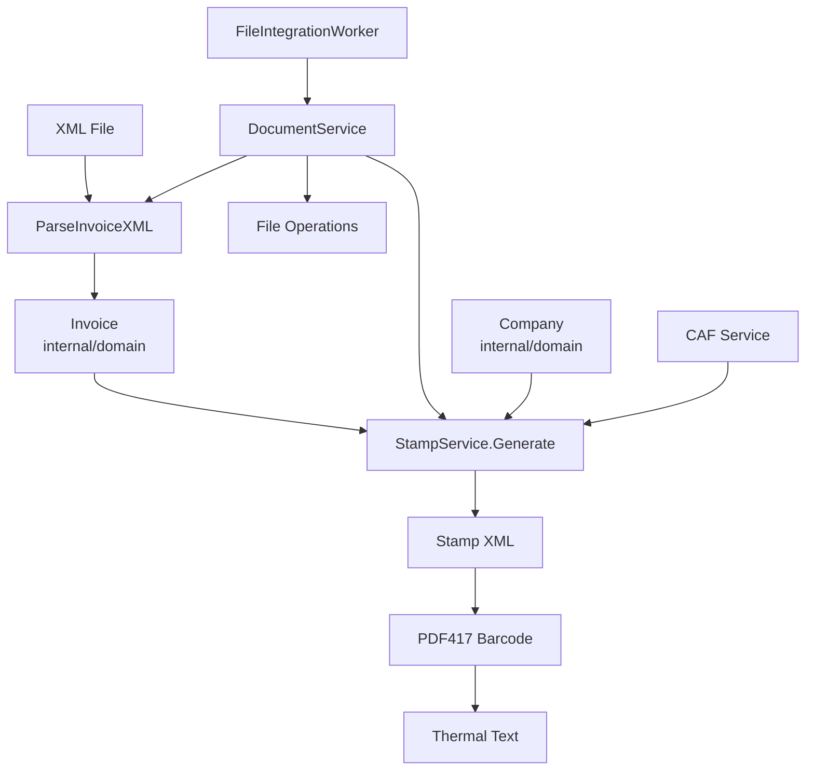

# Document Processor - Chilean Invoice Processing System

## Overview

The Document Processor is a complete automation system for processing Chilean electronic invoices (DTE). It takes XML invoice files through a complete workflow from source to thermal printer output, including electronic stamp generation and PDF417 barcode creation.

## Features

- **Complete Workflow Automation**: Processes invoices from XML to thermal printer format
- **Electronic Stamp Generation**: Creates compliant Chilean SII electronic stamps (TED)
- **PDF417 Barcode Creation**: Generates barcodes for invoice verification
- **Thermal Printer Optimization**: Creates narrow-format output suitable for thermal printers
- **File Management**: Organized file processing with source/inprogress/destination workflow
- **Error Handling**: Comprehensive error reporting and recovery
- **Configurable Directories**: Flexible directory structure via command line

## Architecture

El sistema de procesamiento de documentos del **Factura Móvil Gateway** ha sido simplificado para seguir una arquitectura más directa y eficiente, eliminando capas innecesarias.

## 🏗️ Arquitectura Simplificada



## 📦 Responsabilidades Consolidadas

### Infrastructure & Coordination (`internal/async`)
**FileIntegrationWorker**: Maneja tanto infraestructura como coordinación
- ⏰ Timer-based processing con intervalos configurables
- 📁 Gestión completa de directorios (source, inprogress, destination)
- 🔍 Descubrimiento automático de archivos XML
- 🔄 Orquestación del procesamiento por lotes
- 📊 Logging estructurado y métricas detalladas
- 🎯 Delegación directa al DocumentService

### Use Cases Layer (`internal/usecases`)
**DocumentService**: Contiene la lógica de negocio pura
- `ProcessDocument()` - Workflow completo de procesamiento individual
- Parsing de documentos XML chilenos
- Generación de timbres electrónicos TED
- Creación de códigos PDF417 SII-compliant
- Generación de formato térmico optimizado
- Gestión del flujo de archivos temporales

### Domain Layer (`internal/domain`)
**Entidades de dominio**:
- `Invoice` - Estructura unificada de factura electrónica que combina información completa del documento con compatibilidad para StampService
- `Company` - Información de empresa (emisor/receptor)
- `Stamp` - Timbre electrónico generado
- `CAF` - Código de Autorización de Folios

## 🔄 Flujo de Procesamiento Directo

### 1. Timer Activation
```go
// FileIntegrationWorker ejecuta automáticamente
func (w *FileIntegrationWorker) handleFileIntegration(ctx context.Context, done func()) {
    results, err := w.processAllDocuments()
    // Metrics aggregation and logging
}
```

### 2. Batch Orchestration
```go
// Worker coordina el procesamiento completo
func (w *FileIntegrationWorker) processAllDocuments() ([]usecases.ProcessingResult, error) {
    // 1. Ensure directory structure exists
    w.ensureDirectoriesExist()
    
    // 2. Discover XML files in source directory
    files, err := w.getSourceFiles()
    
    // 3. Process each file via DocumentService
    for _, file := range files {
        result, err := w.documentService.ProcessDocument(file, w.inprogressDirectory, w.destinationDirectory)
        // Error handling and result collection
    }
}
```

### 3. Business Logic Execution
```go
// Direct delegation to business logic
result, err := w.documentService.ProcessDocument(file, inProgressDir, destinationDir)
```

## 🚀 Beneficios de la Simplificación

### ✅ Arquitectura Más Limpia
- **Eliminada capa DocumentProcessor**: Reducción de complejidad innecesaria
- **Responsabilidades consolidadas**: Worker maneja toda la coordinación
- **Flujo directo**: Worker → DocumentService (solo 2 capas principales)

### ✅ Mejor Performance
- **Menos overhead**: Una capa menos de delegación y abstracción
- **Menos objetos**: Menor footprint de memoria
- **Stack traces más cortos**: Debugging y profiling más sencillo

### ✅ Mantenibilidad Mejorada
- **Código más directo**: Lógica de coordinación centralizada
- **Testing simplificado**: Menos mocks y stubs necesarios
- **Onboarding más rápido**: Arquitectura más fácil de entender

### ✅ Flexibilidad Mantenida
- **Clean separation**: Infrastructure vs Business Logic bien definidas
- **Testabilidad**: Worker tests para infraestructura, Service tests para business logic
- **Extensibilidad**: Fácil agregar nuevas funcionalidades en la capa correcta

## 📝 Contratos de Interface

### FileIntegrationWorker Methods
```go
// Worker interface compliance
func (w *FileIntegrationWorker) Run(ctx context.Context, done func())
func (w *FileIntegrationWorker) Shutdown()

// Internal coordination methods
func (w *FileIntegrationWorker) processAllDocuments() ([]usecases.ProcessingResult, error)
func (w *FileIntegrationWorker) ensureDirectoriesExist() error
func (w *FileIntegrationWorker) getSourceFiles() ([]string, error)
```

### DocumentService Interface
```go
type DocumentService interface {
    ProcessDocument(sourceFile, inProgressDir, destinationDir string) (ProcessingResult, error)
}
```

### ProcessingResult Structure
```go
type ProcessingResult struct {
    OriginalFile   string        // Path to processed original file
    StampFile      string        // Path to generated stamp XML
    PDF417File     string        // Path to generated PDF417 barcode
    ThermalPDFFile string        // Path to thermal printer format
    ProcessingTime time.Duration // Time taken for processing
    Error          error         // Any error that occurred
}
```

## 🔧 Integration Pattern

### API Server Integration
```go
// cmd/api/main.go - Simple integration
fileWorker := async.NewFileIntegrationWorker(
    interval,
    sourceDir,
    inprogressDir,
    destinationDir,
)

// Single goroutine startup
go func() {
    fileWorker.Run(ctx, func() {
        slog.Info("file integration worker stopped")
        close(workerDone)
    })
}()
```

### Configuration Management
```go
// Environment-based configuration
sourceDir := getEnvOrDefault("FMG_PROCESSOR_SOURCE_DIR", "")
inprogressDir := getEnvOrDefault("FMG_PROCESSOR_INPROGRESS_DIR", "")
destinationDir := getEnvOrDefault("FMG_PROCESSOR_DESTINATION_DIR", "")
intervalStr := getEnvOrDefault("FMG_PROCESSOR_INTERVAL", "30s")
```

## 📊 Observability & Monitoring

### Structured Logging
```go
// Infrastructure level - file discovery and coordination
slog.Info("Starting document processing batch", 
    "sourceDir", w.sourceDirectory,
    "count", len(files))

// Business level - processing results  
slog.Info("📄 Processing file: %s", result.OriginalFile)
slog.Error("document processing failed", 
    "file", result.OriginalFile, 
    "error", result.Error, 
    "duration", result.ProcessingTime)

// Batch level - aggregated metrics
slog.Info("📊 Batch complete: %d files processed, %d failed", 
    len(results), errorCount)
```

### Error Resilience
```go
// Individual file errors don't stop batch processing
for _, file := range files {
    result, err := w.documentService.ProcessDocument(file, dirs...)
    if err != nil {
        result.Error = err  // Capture error in result
    }
    results = append(results, result)  // Continue with next file
}
```

## 🔄 Processing Workflow Details

### File States and Transitions
```
Source Directory (XML files) 
    ↓ [FileIntegrationWorker.processAllDocuments()]
In-Progress Directory (during processing)
    ↓ [DocumentService.ProcessDocument()]
Destination Directory (complete outputs)
```

### Generated Outputs
Para cada `factura_001.xml`:
- `factura_001.xml` - Original file relocated
- `factura_001_stamp.xml` - Electronic stamp (TED)
- `factura_001_pdf417.png` - SII-compliant barcode
- `factura_001_thermal.txt` - Thermal printer format

## 🎯 Design Principles Applied

### Single Responsibility Principle
- **FileIntegrationWorker**: Infrastructure and coordination only
- **DocumentService**: Business logic only
- **Domain entities**: Data structures and business rules only

### Open/Closed Principle
- Easy to extend DocumentService with new processing steps
- FileIntegrationWorker can be configured with different intervals/directories
- Domain entities can be extended without breaking existing code

### Dependency Inversion
- FileIntegrationWorker depends on DocumentService interface
- DocumentService depends on domain abstractions
- No direct dependencies on external frameworks in business logic

## 🔮 Future Extensibility

La arquitectura simplificada facilita:

### New File Types
```go
// Modify getSourceFiles() method
func (w *FileIntegrationWorker) getSourceFiles() ([]string, error) {
    // Add support for .json, .csv, etc.
}
```

### Different Processing Strategies
```go
// Replace DocumentService implementation
documentService: usecases.NewAdvancedDocumentService(),
```

### Additional Coordination Logic
```go
// Add new methods to FileIntegrationWorker
func (w *FileIntegrationWorker) processWithRetry() error { ... }
func (w *FileIntegrationWorker) processWithBatching() error { ... }
```

### Monitoring Integration
```go
// Add metrics collection in FileIntegrationWorker
func (w *FileIntegrationWorker) collectMetrics(results []usecases.ProcessingResult) {
    // Prometheus, DataDog, etc.
}
```

Esta arquitectura simplificada proporciona una base sólida, mantenible y performante para el procesamiento de documentos electrónicos, eliminando complejidad innecesaria mientras mantiene todas las capacidades requeridas. 🇨🇱

## File Structure

### Input
- `invoice.xml` - Chilean DTE electronic invoice

### Output Files
- `invoice.xml` - Original invoice (moved to destination)
- `invoice_stamp.xml` - Electronic stamp (TED)
- `invoice_pdf417.png` - PDF417 barcode image
- `invoice_thermal.txt` - Thermal printer format text

## Installation

### Prerequisites
- Go 1.21 or higher
- Chilean electronic invoice system knowledge

### Build
```bash
# Make build script executable
chmod +x build-processor.sh

# Build the processor
./build-processor.sh
```

This creates the executable at `bin/processor`.

## Usage

### Command Line

```bash
./bin/processor -source <source_dir> -inprogress <temp_dir> -destination <dest_dir> [options]
```

### Required Parameters
- `-source`: Directory containing XML files to process
- `-inprogress`: Temporary directory for processing files
- `-destination`: Output directory for all generated files

### Optional Parameters
- `-verbose`: Enable detailed debug logging
- `-help`: Show help message

### Examples

```bash
# Basic processing
./bin/processor -source ./invoices -inprogress ./temp -destination ./processed

# With verbose logging
./bin/processor -source ./invoices -inprogress ./temp -destination ./processed -verbose

# Show help
./bin/processor -help
```

## Configuration

### Directory Structure
```
project/
├── invoices/           # Source directory
│   └── invoice1.xml
├── temp/              # In-progress directory (auto-created)
├── processed/         # Destination directory
│   ├── invoice1.xml
│   ├── invoice1_stamp.xml
│   ├── invoice1_pdf417.png
│   └── invoice1_thermal.txt
└── bin/
    └── processor      # Executable
```

### Logging Levels
- **Info**: Basic processing information
- **Debug**: Detailed processing steps (use `-verbose`)
- **Error**: Processing failures and issues

## Electronic Stamp (TED)

The processor generates compliant Chilean SII electronic stamps with:

- **Document Data**: RUT, document type, folio, date, amounts
- **CAF Integration**: Certificate of Electronic Signature Authorization
- **Digital Signature**: RSA-SHA1 signature for document integrity
- **XML Structure**: Standard TED format for SII compliance

## PDF417 Barcode

Generated barcodes include:
- **Stamp Data**: Complete TED information
- **Auto-sizing**: Optimized dimensions for thermal printers
- **PNG Format**: High-quality image output
- **SII Compliance**: Meets Chilean tax authority requirements

## Thermal Printer Output

The thermal text format includes:
- **32-character width**: Optimized for 58mm/80mm thermal printers
- **Header**: Company information and document details
- **Items**: Product descriptions with quantities and prices
- **Totals**: Subtotal, tax, and grand total
- **Footer**: SII verification information
- **Barcode Reference**: Note about separate PDF417 file

### Sample Thermal Output
```
================================
    Empresa Ejemplo S.A.
    RUT: 12345678-9
    Av. Providencia 123, Santiago
================================

FACTURA ELECTRÓNICA N° 1234
Fecha: 26/12/2024

CLIENTE:
Cliente Ejemplo Ltda.
RUT: 87654321-K
Calle Principal 456

DETALLE:
--------------------------------
1 x Producto de Ejemplo
    $8403 c/u = $8403
--------------------------------

Subtotal:    $8403
IVA (19%):   $1597
TOTAL:       $10000

================================
     Timbre Electronico SII
   Resolucion N° XX del YYYY
 Verifique documento en www.sii.cl
================================

[PDF417 barcode saved separately]
```

## Error Handling

### Common Issues
- **Missing directories**: Automatically created if they don't exist
- **Invalid XML**: Detailed error messages for parsing issues
- **File permissions**: Clear reporting of access problems
- **Processing failures**: Individual file errors don't stop batch processing

### Exit Codes
- `0`: Success - all files processed
- `1`: Failure - errors occurred during processing

## Testing

### Sample Invoice
A test invoice is provided at `test_invoices/sample_invoice.xml`.

### Test Run
```bash
# Create test directories
mkdir -p test_temp test_output

# Copy sample invoice
cp test_invoices/sample_invoice.xml test_source/

# Process
./bin/processor -source test_source -inprogress test_temp -destination test_output -verbose
```

## Integration

### API Integration
The processor can be integrated into larger systems:

```go
import "github.com/sdiazmoreno/fm-gateway/internal/processor"

// Create processor
proc := processor.NewDocumentProcessor(sourceDir, tempDir, destDir, logger)

// Process all documents
results, err := proc.ProcessAllDocuments()

// Handle results
for _, result := range results {
    if result.Error != nil {
        // Handle error
    } else {
        // Process successful result
    }
}
```

### Batch Processing
The processor is designed for batch operations and can handle multiple files efficiently.

## Chilean Compliance

### SII Requirements
- **Electronic Stamps**: Full TED generation with digital signatures
- **PDF417 Barcodes**: Compliant barcode format and content
- **Document Types**: Support for invoices (33), exempt invoices (34), receipts (39, 41)
- **CAF Integration**: Certificate validation and usage

### Standards
- **XML Format**: Standard Chilean DTE structure
- **Encoding**: UTF-8 with ISO-8859-1 signature compatibility
- **Signatures**: RSA-SHA1 digital signatures

## Monitoring

### Logging
All operations are logged with structured logging:

```
INFO Starting document processing source=./invoices inprogress=./temp destination=./processed
INFO Found files to process count=3
INFO Successfully processed document file=invoice1.xml processingTime=245ms
INFO Document processing completed total=3 success=3 errors=0
```

### Metrics
Track processing performance:
- **Processing time per document**
- **Success/failure rates**
- **File sizes and throughput**

## Troubleshooting

### Build Issues
```bash
# Check Go version
go version

# Clean and rebuild
go clean
./build-processor.sh
```

### Runtime Issues
```bash
# Check file permissions
ls -la invoices/

# Run with verbose logging
./bin/processor -verbose -source ./invoices -inprogress ./temp -destination ./processed
```

### Common Problems
1. **Permission denied**: Ensure directories are writable
2. **File not found**: Check source directory path
3. **Invalid XML**: Validate XML structure
4. **Processing timeout**: Check system resources

## Development

### Code Structure
```
internal/processor/
├── document_processor.go  # Main processing logic
internal/domain/
├── invoice_document.go    # Invoice data structures
internal/utils/
├── stamp_generator.go     # Electronic stamp generation
cmd/processor/
├── main.go               # Command line interface
```

### Testing
```bash
# Run tests
go test ./internal/processor

# Test with sample data
./bin/processor -source ./test_invoices -inprogress ./temp -destination ./test_output -verbose
```

### Contributing
1. Follow Go coding standards
2. Add tests for new functionality
3. Update documentation
4. Ensure Chilean compliance

## License

This project is part of the Factura Móvil Gateway system and follows the same licensing terms.

## Support

For issues and questions:
1. Check the logs with `-verbose` flag
2. Validate input XML format
3. Ensure proper directory permissions
4. Review Chilean DTE documentation 