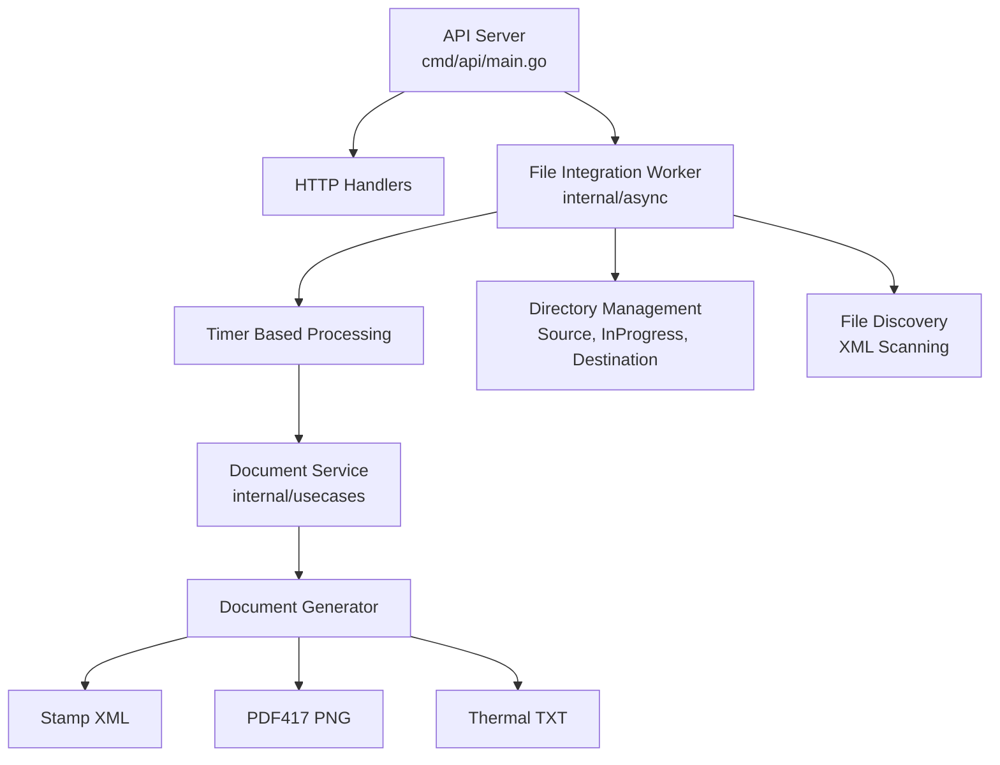
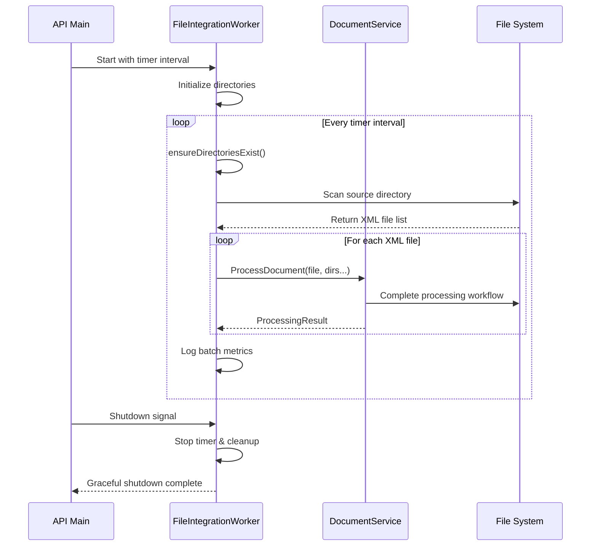

# File Integration Worker

El **FileIntegrationWorker** está integrado directamente en la API principal del **Factura Móvil Gateway**. Maneja automáticamente el descubrimiento de archivos XML de facturas, orquesta el procesamiento completo y genera timbres electrónicos, códigos PDF417 y documentos para impresión térmica.

## 🏗️ Arquitectura Simplificada

El worker ahora maneja directamente la integración con el DocumentService:



## 📦 Responsabilidades Integradas

### FileIntegrationWorker (`internal/async`)
**Worker completo con responsabilidades integradas**:
- ⏰ **Timer Management**: Procesamiento basado en intervalos
- 📁 **Directory Management**: Creación y gestión de directorios
- 🔍 **File Discovery**: Escaneo automático de archivos XML
- 🔄 **Processing Orchestration**: Coordinación del flujo completo
- 📊 **Metrics & Logging**: Seguimiento de resultados y errores
- 🎯 **Business Logic Integration**: Delegación directa al DocumentService

### DocumentService (`internal/usecases`)
**Lógica de negocio pura**:
- 📄 **Document Processing**: Workflow completo de procesamiento
- 🔐 **Stamp Generation**: Generación de timbres electrónicos TED
- 📱 **PDF417 Creation**: Códigos de barras SII-compliant
- 🖨️ **Thermal Format**: Documentos optimizados para impresión térmica

## 🔄 Flujo de Procesamiento Simplificado

### 1. Timer Tick
```go
// FileIntegrationWorker ejecuta cada intervalo
func (w *FileIntegrationWorker) handleFileIntegration(ctx context.Context, done func()) {
    results, err := w.processAllDocuments()
    // Logging y métricas
}
```

### 2. Descubrimiento y Orquestación
```go
// Worker maneja directamente la coordinación
func (w *FileIntegrationWorker) processAllDocuments() ([]usecases.ProcessingResult, error) {
    // 1. Asegurar directorios existen
    // 2. Obtener archivos XML del directorio fuente
    // 3. Procesar cada archivo usando DocumentService
    // 4. Recopilar resultados y métricas
}
```

### 3. Procesamiento de Negocio
```go
// Delegación directa al DocumentService
result, err := w.documentService.ProcessDocument(file, inProgressDir, destinationDir)
```

## 🚀 Beneficios de la Arquitectura Simplificada

### ✅ Menos Capas, Más Claridad
- **Eliminada capa intermedia**: DocumentProcessor ya no es necesario
- **Responsabilidades claras**: Worker = Coordinación, Service = Business Logic
- **Menos complejidad**: Flujo directo Worker → Service

### ✅ Mejor Rendimiento
- **Menos overhead**: Una capa menos de delegación
- **Acceso directo**: Worker accede directamente al DocumentService
- **Gestión eficiente**: Menos creación/destrucción de objetos

### ✅ Mantenibilidad Mejorada
- **Código más directo**: Lógica de coordinación en un solo lugar
- **Debugging simplificado**: Stack trace más corto y claro
- **Testing enfocado**: Worker tests para coordinación, Service tests para business logic

### ✅ Responsabilidades Bien Definidas
- **FileIntegrationWorker**: Todo lo relacionado con infraestructura y coordinación
- **DocumentService**: Solo business logic de procesamiento de documentos
- **Domain Layer**: Entidades puras sin dependencias

## 📝 API del Worker

### Constructor
```go
func NewFileIntegrationWorker(
    tickerInterval time.Duration,
    sourceDirectory, inprogressDirectory, destinationDirectory string,
) *FileIntegrationWorker
```

### Métodos Principales
```go
// Interface Worker
func (w *FileIntegrationWorker) Run(ctx context.Context, done func())
func (w *FileIntegrationWorker) Shutdown()

// Métodos internos de coordinación
func (w *FileIntegrationWorker) processAllDocuments() ([]usecases.ProcessingResult, error)
func (w *FileIntegrationWorker) ensureDirectoriesExist() error
func (w *FileIntegrationWorker) getSourceFiles() ([]string, error)
```

## 🔧 Configuración y Uso

### Variables de Entorno
```bash
export FMG_PROCESSOR_SOURCE_DIR="./invoices"
export FMG_PROCESSOR_INPROGRESS_DIR="./temp"
export FMG_PROCESSOR_DESTINATION_DIR="./processed"
export FMG_PROCESSOR_INTERVAL="30s"
```

### Inicialización en API
```go
// cmd/api/main.go
fileWorker = async.NewFileIntegrationWorker(
    interval,
    sourceDir,
    inprogressDir,
    destinationDir,
)

// Inicio automático
go func() {
    fileWorker.Run(ctx, func() {
        slog.Info("file integration worker stopped")
    })
}()
```

## 📊 Logging y Métricas Integradas

El worker proporciona logging completo en todos los niveles:

```go
// Coordinación y descubrimiento
slog.Info("Starting document processing batch", "sourceDir", w.sourceDirectory)
slog.Info("Found files to process", "count", len(files))

// Resultados individuales
slog.Info("📄 Processing file: %s", result.OriginalFile)
slog.Error("document processing failed", "file", result.OriginalFile, "error", result.Error)

// Métricas de lote
slog.Info("📊 Batch complete: %d files processed, %d failed", len(results), errorCount)
```

## 🔄 Lifecycle Simplificado



## 🚨 Gestión de Errores Robusta

```go
// Errores no bloquean el procesamiento completo
for _, file := range files {
    result, err := w.documentService.ProcessDocument(file, dirs...)
    if err != nil {
        result.Error = err  // Error capturado en resultado
    }
    results = append(results, result)  // Procesamiento continúa
}

// Logging detallado de errores
if result.Error != nil {
    slog.Error("Failed to process document", "file", file, "error", result.Error)
}
```

## 🎯 Casos de Uso

### 1. Procesamiento Automático
- Documentos se depositan en `source_directory`
- Worker los descubre automáticamente en cada tick
- Procesamiento completo sin intervención manual

### 2. Monitoreo y Alertas
- Logs estructurados para integración con sistemas de monitoreo
- Métricas de éxito/fallo por lote
- Tracking de tiempo de procesamiento

### 3. Recuperación de Errores
- Archivos con errores no bloquean el procesamiento
- Cleanup automático de archivos temporales
- Logs detallados para debugging

## 🔮 Extensibilidad

La arquitectura simplificada facilita:

- **Nuevos tipos de archivos**: Modificar `getSourceFiles()`
- **Diferentes strategies de procesamiento**: Intercambiar DocumentService
- **Métricas adicionales**: Agregar al worker sin afectar business logic
- **Diferentes triggers**: Timer, filesystem events, APIs, etc.

El FileIntegrationWorker ahora es una solución completa y autocontenida para el procesamiento automático de documentos electrónicos chilenos. 🇨🇱 